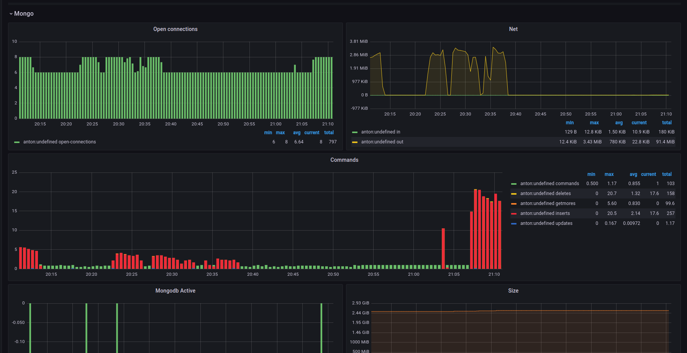
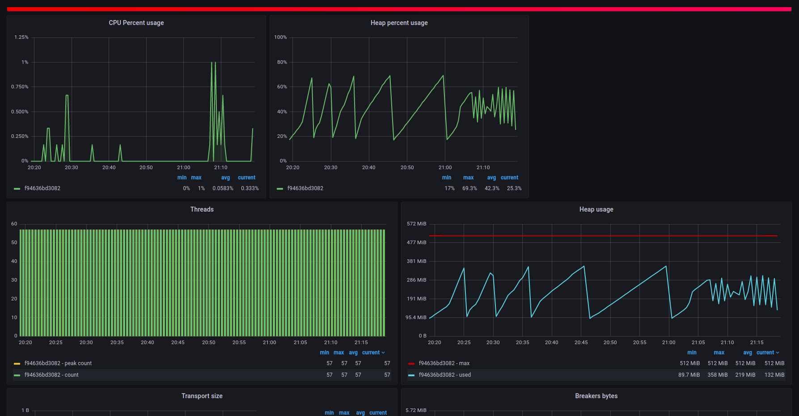
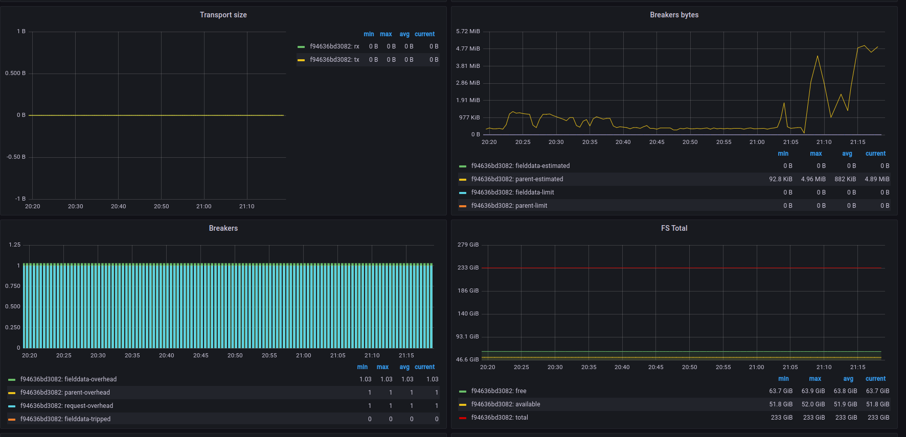
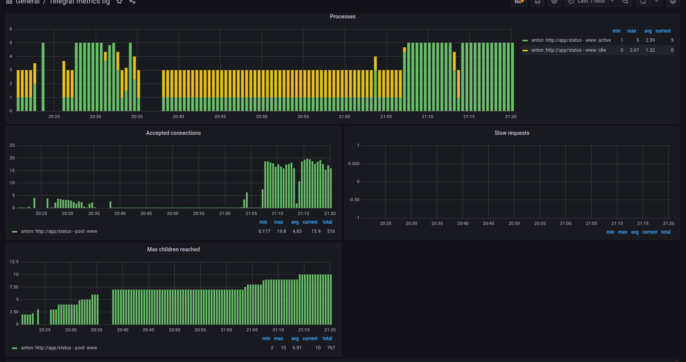
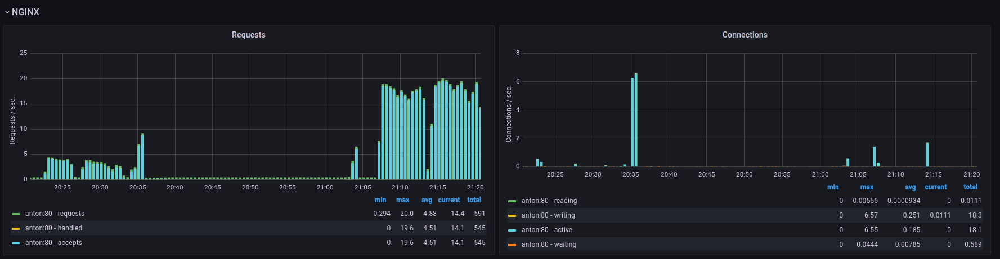

# Requirements
* Docker
* Docker-compose 
* siege

# Example Docker Compose project for Telegraf, InfluxDB and Grafana

This an example project to show the TIG (Telegraf, InfluxDB and Grafana) stack.


## Start 

```bash
$ ./devops build 
$ ./devops up -d
$ ./devops stress  
```

### Mongo

### ElasticSearch



### Php-fpm

### Nginx

